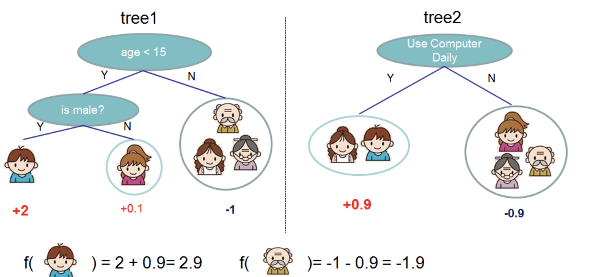
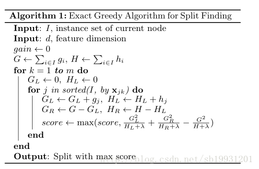
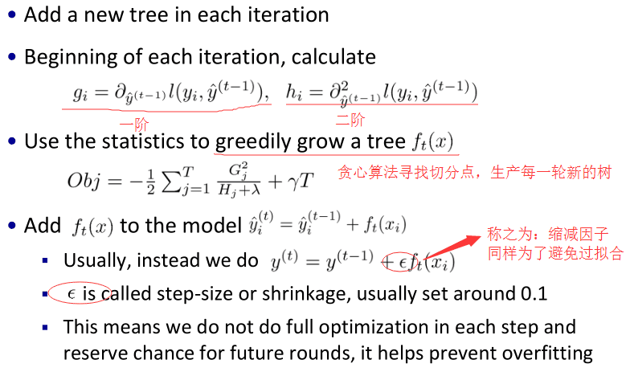

# XGBoost

## 1. XGBoost原理

参考文献：

1. http://xgboost.readthedocs.io/en/latest/model.html
2. https://blog.csdn.net/sb19931201/article/details/52557382

一般，机器学习模型的目标函数由两部分组成——损失误差函数+正则项：
$$
obj(\theta )=L(\theta )+\Omega (\theta )
$$

> 其中，L为训练损失函数、$\Omega$为正则项。
>
> 例如，常见的L函数有：MSE：$L(\theta )=\sum _{ i }^{  }{ (y_i-\hat { y_i } )^2 } $
>
> 逻辑回归的L函数：$L(\theta )=\sum _{ i }^{  }{ [y_i\ln { (1+e^{-\hat { y_i } } )} + (1-y_i)\ln { 1 + e^{\hat { y_i }} }]} $
>
> 正则项常有L0、L1、L2，主要是为了解决模型过于复杂导致过拟合问题。

首先我们先了解下树的集成效果：

以上为两个单独的数所预测的结果，若将两棵树结合起来，则预测结果分别为2.9、1.9 。即一种简单的树集成效果为多棵树预测结果进行求和平均，如下式所示：
$$
\hat { y_{ i } } =\sum _{ k=1 }^{ K }{ f_{ k }(x_{ i }),f_{ k }\in  \digamma  } 
$$

> 其中，K为树的数量， $f$为预测函数

那么此时，目标函数应该改写为：
$$
obj(\theta )=\sum _{ i }^{ n }{ l(y_{ i },\hat { y_{ i } } ) } +\sum _{ k=1 }^{ K }{ \Omega(f_k)  } 
$$

> 其中，可以看出，树集成的目标函数主要分两大部分：损失函数、所有树的正则项

### 损失函数

从上图可以看出，对Boosting模型来说，其预测为逐级累加，即如下式:
$$
 \hat { y_{ i } } ^{ (0) }=0\\ \hat { y_{ i } } ^{ (1) }=f_{ 1 }(x_{ i })={ y_{ i } }^{ (0) }+f_{ 1 }(x_{ i })\\ \hat { y_{ i } } ^{ (2) }=f_{ 1 }(x_{ i })+f_{ 2 }(x_{ i })={ y_{ i } }^{ (1) }+f_{ 2 }(x_{ i })\\ \qquad ...\\ \hat { y_{ i } } ^{ (t) }=\sum _{ k=1 }^{ t }{ f_{ k }(x_{ i }) } ={ y_{ i } }^{ (t-11) }+f_{ t }(x_{ i })
$$
那么将预测值$\hat{y_i}^{(t)}$代入目标函数，可得：
$$
obj^{ (t) }=\sum _{ i=1 }^{ n }{ l(y_{ i },\hat { y_{ i } } ^{ (t) }) } +\sum _{ i=1 }^{ t }{ \Omega (f_{ i }) } \\ \qquad =\sum _{ i=1 }^{ n }{ l(y_{ i },\hat { y_{ i } } ^{ (t-1) }+f_t(x_i)) } +\Omega (f_{ t }) +constant
$$
假设我们采用MSE作为损失函数，则代入MSE对应的损失函数，目标函数可以转换为：
$$
obj^{ (t) }=\sum _{ i=1 }^{ n }{ (y_{ i }-(\hat { y_i }^{(t-1)} +f_t(x_i)))^{ 2 } } +\sum _{ i=1 }^{ t }{ \Omega (f_{ i }) } \\ \qquad =\sum _{ i=1 }^{ n }{ [2(\hat { y_i }^{(t-1)}-y_i )f_t(x_i)+f_t(x_i)^2]} +\Omega (f_{ t })+constant
$$
==注意：==此处为XGBoost与普通GBDT的不同点一：

==对6式中做泰勒展开，并保留二阶子式，（普通GBDT仅含有一阶子式）==

可以得到：
$$
obj^{ (t) }=\sum _{ i=1 }^{ n }{ [l(\hat { y_{ i } } ^{ (t-1) },y_{ i })  +g_if_{ t }(x_{ i })+\frac { 1 }{ 2 } h_if_{ t }(x_{ i })^{ 2 }] } +\Omega (f_{ t })+constant
$$

> 其中：
> $$
> g_{ i }=\partial _{ \hat { y_{ i } } ^{ (t-1) } }l(\hat { y_{ i } } ^{ (t-1) },y_{ i })\\ h_{ i }=\partial^2 _{ \hat { y_{ i } } ^{ (t-1) } }l(\hat { y_{ i } } ^{ (t-1) },y_{ i })
> $$
> 

### 正则项

接下来我们考虑正则项$\Omega$

我们定义3式中对应的$f_k$为
$$
f_t(x)=w_{q(x)},w\in R^T, q:R^d\rightarrow {1,2,...,T}
$$

> 其中，$w$为每棵树所有叶子对应的得分向量，$q$为与数据点与叶子对应的函数，T为叶子数目

==注意：==此处为XGBoost与普通GBDT的不同点二：

据此，在XGBoost中，定义正则项$\Omega$为模型复杂度，如下:
$$
\Omega (f)=\gamma T+\frac { 1 }{ 2 } \lambda \sum _{ j=1 }^{ T }{ w_j^2 } 
$$

> 也就是说，正则项包含两项：叶子数目，L2正则项。

那么我们可以得到第t棵树的目标函数为：
$$
obj^{ (t) }\approx \sum _{ i=1 }^{ n }{ [g_{ i }w_{ q(x_{ i }) }+\frac { 1 }{ 2 } h_{ i }w^{ 2 }_{ q(x_{ i }) }] } +\gamma T+\frac { 1 }{ 2 } \lambda \sum _{ j=1 }^{ T }{ w_{ j }^{ 2 } } \\ \qquad =\sum _{ j=1 }^{ T }{ [(\sum _{ i\in I_{ j } }{ g_{ i } } )w_{ j }+\frac { 1 }{ 2 } (\sum _{ i\in I_{ j } }{ h_{ i } } +\lambda )w^2_{ j }] } +\gamma T
$$

> 其中，$I_{ j }=\left\{ i|q(x_i)=j \right\} $代表第j个叶子对应的数据点索引集合

此时，我们令：
$$
G_{ j }=\sum _{ i\in I_{ j } }{ g_{ i } } \\ H_j=\sum_{i\in I_j } { h_i }
$$
可以得到目标函数为：
$$
obj^{ (t) }=\sum _{ j=1 }^{ T }{ [G_{ j }w_{ j }+\frac { 1 }{ 2 } (H_j+\lambda )w^{ 2 }_{ j }] } +\gamma T
$$

> 很容易可以计算出$w_j$的最优解为:
> $$
> w^*_j=-\frac { G_j }{ H_j +\lambda  }
> $$
>

从而得到对应的目标函数为：
$$
obj^{ * }_{ j }=-\frac { 1 }{ 2 } \sum _{ j=1 }^{ T }{ \frac { G_{ j }^{ 2 } }{ H_{ j }^{ 2 }+\lambda  }  } +\gamma T
$$

### 树分裂（树结构）打分算法：

最常见的就是贪心法，对某个叶子进行分裂，若分裂后的目标函数比分裂前的目标函数更优(信息增益大于0)，则进行树分裂。

==XGBoost中的增益计算如下：==
$$
Gain=\frac { 1 }{ 2 } [\frac { G_L^2 }{ H_L+\lambda  } +\frac { G_R^2 }{ H_R+\lambda  } -\frac { (G_L+G_R)^2 }{ H_L+H_R+\lambda  } ]-\gamma 
$$

> 即增益为0.5*（新左子树分数+右子树分数-不分裂叶子分数）-加入新叶子节点引入的复杂度

==此外，作者针对该算法设计对特征进行了排序，分位点划分等。==

根据特征划分有无数可能的树结构，因此采用近似算法（特征分位点，候选分割点）

### 总结

- 每轮增加一棵树
- 传统GBDT以CART作为基分类器，xgboost还支持线性分类器，这个时候xgboost相当于带L1和L2正则化项的逻辑斯蒂回归（分类问题）或者线性回归（回归问题）。 **—可以通过booster [default=gbtree]设置参数:gbtree: tree-based models/gblinear: linear models**
- 损失函数引入二阶导数，传统GBDT在优化时只用到一阶导数信息
- 损失函数中加入了正则项，用于控制模型的复杂度。正则项里包含了树的叶子节点个数、每个叶子节点上输出的score的L2模的平方和。从Bias-variance tradeoff角度来讲，正则项降低了模型variance，使学习出来的模型更加简单，防止过拟合，这也是xgboost优于传统GBDT的一个特性  **—正则化包括了两个部分，都是为了防止过拟合，剪枝是都有的，叶子结点输出L2平滑是新增的。**
- shrinkage and column subsampling —**还是为了防止过拟合**
- 树分裂（树打分）为贪心算法寻找切分点
  - exact greedy algorithm—**贪心算法获取最优切分点** 
  - approximate algorithm— **近似算法，提出了候选分割点概念，先通过直方图算法获得候选分割点的分布情况，然后根据候选分割点将连续的特征信息映射到不同的buckets中，并统计汇总信息。**
  - Weighted Quantile Sketch—**分布式加权直方图算法，**
- 添加新树时引入缩减因子避免过拟合
- 对缺失值的处理。对于特征的值有缺失的样本，xgboost可以自动学习出它的分裂方向。 **—稀疏感知算法**

### XGBoost包的特点

- **Built-in Cross-Validation（内置交叉验证)**

- **continue on Existing Model（接着已有模型学习）**

- **High Flexibility（高灵活性）**

- 并行化处理 **—系统设计模块,块结构设计等**

  - > xgboost工具支持并行。boosting不是一种串行的结构吗?怎么并行的？注意xgboost的并行不是tree粒度的并行，xgboost也是一次迭代完才能进行下一次迭代的（第t次迭代的代价函数里包含了前面t-1次迭代的预测值）。xgboost的并行是在特征粒度上的。我们知道，决策树的学习最耗时的一个步骤就是对特征的值进行排序（因为要确定最佳分割点），xgboost在训练之前，预先对数据进行了排序，然后保存为block结构，后面的迭代中重复地使用这个结构，大大减小计算量。这个block结构也使得并行成为了可能，在进行节点的分裂时，需要计算每个特征的增益，最终选增益最大的那个特征去做分裂，那么各个特征的增益计算就可以开多线程进行。

## 2. XGBoost参数

## 3. XGBoost使用

## 4. XGBoost sklearn接口