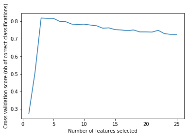

# 特征选择(Feature Selection)

当数据预处理完成后，我们需要选择有意义的特征输入机器学习的算法和模型进行训练。通常来说，从两个方面考虑来选择特征：

- **特征是否发散**：如果一个特征不发散，例如方差接近于0，也就是说样本在这个特征上基本上没有差异，这个特征对于样本的区分并没有什么用。
- **特征与目标的相关性**：这点比较显见，与目标相关性高的特征，应当优选选择。除移除低方差法外，本文介绍的其他方法均从相关性考虑。

根据特征选择的形式又可以将特征选择方法分为3种：

- **Filter**：过滤法，按照发散性或者相关性对各个特征进行评分，设定阈值或者待选择阈值的个数，选择特征。
- **Wrapper**：包装法，根据目标函数（通常是预测效果评分），每次选择若干特征，或者排除若干特征。
- **Embedded**：嵌入法，先使用某些机器学习的算法和模型进行训练，得到各个特征的权值系数，根据系数从大到小选择特征。类似于Filter方法，但是是通过训练来确定特征的优劣。

特征选择主要有两个目的：

- 减少特征数量、降维，使模型泛化能力更强，减少过拟合；
- 增强对特征和特征值之间的理解。

　　拿到数据集，一个特征选择方法，往往很难同时完成这两个目的。通常情况下，选择一种自己最熟悉或者最方便的特征选择方法（往往目的是降维，而忽略了对特征和数据理解的目的）。

| 类名              | 功能                 | 说明                                                   |
| ----------------- | -------------------- | ------------------------------------------------------ |
| VarianceThreshold | 特征选择（Filter）   | 方差选择法                                             |
| SelectKBest       | 特征选择（Filter）   | 可选关联系数、卡方校验、最大信息系数作为得分计算的方法 |
| RFE               | 特征选择（Wrapper）  | 递归地训练基模型，将权值系数较小的特征从特征集合中消除 |
| SelectFromModel   | 特征选择（Embedded） | 训练基模型，选择权值系数较高的特征                     |
| PCA               | 降维（无监督）       | 主成分分析法                                           |
| LDA               | 降维（有监督）       | 线性判别分析法                                         |

## 1 去掉取值变化小的特征

Removing features with low variance

这是最简单的特征选择方法：假设某特征的特征值只有0和1，并且在所有输入样本中，95%的实例的该特征取值都是1，那就可以认为这个特征作用不大。如果100%都是1，那这个特征就没有意义了。**即考察某个特征下，样本的方差值，可以人为给定一个阈值，抛开那些小于这个阈值的特征。**

需要注意的是，**这种方法必须当特征值是离散型变量时才能用**。若是连续型变量，就需要将连续变量离散化之后才能用。除此之外，在实际项目中，一般不太会有95%以上都取某个值的特征存在，所以这种方法虽然简单但是不太好用。一般可以把它作为特征选择的预处理，先去掉那些取值变化小的特征，然后再从接下来提到的特征选择方法中选择合适的进行进一步的特征选择。

```
sklearn.feature_selection.VarianceThreshold(threshold=0.0)

例如：
from sklearn.feature_selection import VarianceThreshold
X = [[0, 0, 1], [0, 1, 0], [1, 0, 0], [0, 1, 1], [0, 1, 0], [0, 1, 1]]
sel = VarianceThreshold(threshold=(.8 * (1 - .8)))
sel.fit_transform(X)
# 去掉了一个特征(第一列)
＃array([[0, 1],
       [1, 0],
       [0, 0],
       [1, 1],
       [1, 0],
       [1, 1]])
```

## 2 单变量特征选择

Univariate feature selection

基于单变量统计测试。单变量特征选择能够对每一个特征进行测试，衡量该特征和响应变量之间的关系，根据得分扔掉得分查的特征。

对于**分类问题(y离散)**，可采用： 　　　　

- 卡方检验*，*f_classif*, *mutual_info_classif*，*互信息* 　　

对于**回归问题(y连续)**，可采用： 　　　　

- *皮尔森相关系数*，*f_regression*, *mutual_info_regression*，*最大信息系数*

方法简单，易于运行，易于理解，通常对于理解数据有较好的效果（但对特征优化、提高泛化能力来说，不移地有效）。一般此作为特征选取前处理中的一步。

```
# 选取前k=10个分数较高的特征
sklearn.feature_selection.SelectKBest(score_func=<function f_classif>, k=10)

# 常见的打分评价函数有：
f_regression（单因素线性回归试验）用作回归 
chi2卡方检验，f_classif（方差分析的F值）等用作分类
	f_classif: ANOVA F-value between label/feature for classification tasks.
    mutual_info_classif: Mutual information for a discrete target.
    chi2: Chi-squared stats of non-negative features for classification tasks.
    f_regression: F-value between label/feature for regression tasks.
    mutual_info_regression: Mutual information for a continuous target.
    SelectPercentile: Select features based on percentile of the highest scores.
    SelectFpr: Select features based on a false positive rate test.
    SelectFdr: Select features based on an estimated false discovery rate.
    SelectFwe: Select features based on family-wise error rate.
    GenericUnivariateSelect: Univariate feature selector with configurable mode.
```

其他单特征选取方法：

```
# 选取前10%得分的特征
sklearn.feature_selection.SelectPercentile(score_func=<function f_classif>, percentile=10)

# 假阳性率（false positive rate） SelectFpr
# alpha是预期错误发现率的上限,默认是0.5,score_func 默认为 f_classif
sklearn.feature_selection.SelectFpr(score_func=<function f_classif>, alpha=0.05)

# 伪发现率（false discovery rate） SelectFdr
# alpha是预期错误发现率的上限
selector2 = SelectFdr(score_func = f_classif,alpha=4.37695696e-80) 

# 族系误差（family wise error） SelectFwe
# alpha是预期错误发现率的上限
selector3 = SelectFwe(score_func = chi2,alpha=1) 

```

> 注：
>
> 1）经典的卡方检验是检验定性自变量对定性因变量的相关性。
>
> 2）peason相关系数，缺点：只对线性相关系数敏感
>
> 3）距离相关系数
>
> 比较: 第一、Pearson相关系数计算速度快，这在处理大规模数据的时候很重要。第二、Pearson相关系数的取值区间是[-1，1]，距离相关系数都是[0，1]。这个特点使得Pearson相关系数能够表征更丰富的关系，符号表示关系的正负，绝对值能够表示强度。当然，Pearson相关性有效的前提是两个变量的变化关系是单调的。
>
> 4）基于学习模型的特征排序
>
> ​    这种方法的思路是直接使用你要用的机器学习算法，针对每个单独的特征和响应变量建立预测模型
>
> ​    Pearson相关系数等价于线性回归里的标准化回归系数

#### 2.1 卡方(Chi2)检验

　　经典的卡方检验是检验定性自变量对定性因变量的相关性。比如，我们可以对样本进行一次chi2chi2 测试来选择最佳的两项特征：

```
>>> from sklearn.datasets import load_iris
>>> from sklearn.feature_selection import SelectKBest
>>> from sklearn.feature_selection import chi2
>>> iris = load_iris()
>>> X, y = iris.data, iris.target
>>> X.shape
(150, 4)
>>> X_new = SelectKBest(chi2, k=2).fit_transform(X, y)
>>> X_new.shape
(150, 2)
```

#### 2.2 Pearson相关系数 (Pearson Correlation)

　　皮尔森相关系数是一种最简单的，能帮助理解特征和响应变量之间关系的方法，该方法衡量的是变量之间的线性相关性，结果的取值区间为[-1，1]，-1表示完全的负相关，+1表示完全的正相关，0表示没有线性相关。

　　Pearson Correlation速度快、易于计算，经常在拿到数据(经过清洗和特征提取之后的)之后第一时间就执行。Scipy的 pearsonr 方法能够同时计算 相关系数 和p-value.

```
import numpy as np
from scipy.stats import pearsonr
np.random.seed(0)
size = 300
x = np.random.normal(0, 1, size)
# pearsonr(x, y)的输入为特征矩阵和目标向量
print("Lower noise", pearsonr(x, x + np.random.normal(0, 1, size)))
print("Higher noise", pearsonr(x, x + np.random.normal(0, 10, size)))
>>>
# 输出为二元组(sorce, p-value)的数组
Lower noise (0.71824836862138386, 7.3240173129992273e-49)
Higher noise (0.057964292079338148, 0.31700993885324746)
```

这个例子中，我们比较了变量在加入噪音之前和之后的差异。当噪音比较小的时候，相关性很强，p-value很低。

　　Scikit-learn提供的 [f_regrssion](http://scikit-learn.org/stable/modules/generated/sklearn.feature_selection.f_regression.html) 方法能够批量计算特征的f_score和p-value，非常方便，参考sklearn的 [pipeline](http://scikit-learn.org/stable/modules/generated/sklearn.pipeline.Pipeline.html)

　　**Pearson相关系数的一个明显缺陷是，作为特征排序机制，他只对线性关系敏感。如果关系是非线性的，即便两个变量具有一一对应的关系，Pearson相关性也可能会接近0。**例如：

> x = np.random.uniform(-1, 1, 100000)
> print pearsonr(x, x**2)[0]
> -0.00230804707612

　　更多类似的例子参考 [sample plots](http://upload.wikimedia.org/wikipedia/commons/thumb/d/d4/Correlation_examples2.svg/506px-Correlation_examples2.svg.png) 。另外，如果仅仅根据相关系数这个值来判断的话，有时候会具有很强的误导性，如 [Anscombe’s quartet](http://www.matrix67.com/blog/archives/2308) ，最好把数据可视化出来，以免得出错误的结论。

#### 2.3 互信息和最大信息系数 (Mutual information and maximal information coefficient (MIC)

　　经典的互信息（互信息为随机变量X与Y之间的互信息I(X;Y)I(X;Y)为单个事件之间互信息的数学期望）也是评价定性自变量对定性因变量的相关性的，互信息计算公式如下：

I(X;Y)=E[I(xi;yj)]=∑xiϵX∑yjϵYp(xi,yj)logp(xi,yj)p(xi)p(yj)I(X;Y)=E[I(xi;yj)]=∑xiϵX∑yjϵYp(xi,yj)logp(xi,yj)p(xi)p(yj)

　　互信息直接用于特征选择其实不是太方便：1、它不属于度量方式，也没有办法归一化，在不同数据及上的结果无法做比较；2、对于连续变量的计算不是很方便（X和Y都是集合，x，y都是离散的取值），通常变量需要先离散化，而互信息的结果对离散化的方式很敏感。

　　最大信息系数克服了这两个问题。它首先寻找一种最优的离散化方式，然后把互信息取值转换成一种度量方式，取值区间在[0，1]。 [minepy](http://minepy.readthedocs.io/en/latest/) 提供了MIC功能。

反过头来看y=x2y=x2这个例子，MIC算出来的互信息值为1(最大的取值)。

```
from minepy import MINE
m = MINE()
x = np.random.uniform(-1, 1, 10000)
m.compute_score(x, x**2)
print(m.mic())
>>>1.0
```

　　MIC的统计能力遭到了 [一些质疑](http://statweb.stanford.edu/~tibs/reshef/comment.pdf) ，当零假设不成立时，MIC的统计就会受到影响。在有的数据集上不存在这个问题，但有的数据集上就存在这个问题。

#### 2.4 距离相关系数 (Distance Correlation)

　　距离相关系数是为了克服Pearson相关系数的弱点而生的。在xx和x2x2这个例子中，即便Pearson相关系数是0，我们也不能断定这两个变量是独立的（有可能是非线性相关）；但如果距离相关系数是0，那么我们就可以说这两个变量是独立的。

　　R的 energy 包里提供了距离相关系数的实现，另外这是 [Python gist](https://gist.github.com/josef-pkt/2938402) 的实现。

```
> x = runif (1000, -1, 1)
> dcor(x, x**2)
[1] 0.4943864
```

　　尽管有 MIC 和 距离相关系数 在了，但当变量之间的关系接近线性相关的时候，Pearson相关系数仍然是不可替代的。
　　第一，Pearson相关系数计算速度快，这在处理大规模数据的时候很重要。
　　第二，Pearson相关系数的取值区间是[-1，1]，而MIC和距离相关系数都是[0，1]。这个特点使得Pearson相关系数能够表征更丰富的关系，符号表示关系的正负，绝对值能够表示强度。当然，Pearson相关性有效的前提是两个变量的变化关系是单调的。


## 3 递归特征消除

Recursive feature elimination  (RFE)

递归特征消除的主要思想是反复的构建模型(如SVM或回归模型)， 然后选出最好的（或最差的）的特征（可以根据系数来选），把选出来的特征选择出来，然后在剩余的特征上重复这个过程，直到所有特征都遍历了。在这个过程中，**特征被消除的次序就是特征的排序**。因此，这是一种**寻找最优特征子集的贪心算法**。

RFE的稳定性很大程度上取决于在迭代过程中底层所选择的模型。例如，RFE采用普通回归时，没有经过正则化的回归是不稳定的，那么RFE就是不稳定的；RFE采用的是Ridge，而Ridge正则化的回归是稳定的，那么RFE就是稳定的。

在sklearn中有两个递归式特征消除的方法：

- `recursive feature elimination ( RFE )`通过学习器返回的 coef_ 属性 或者 feature_importances_ 属性来获得每个特征的重要程度。 然后，从当前的特征集合中移除最不重要的特征。在特征集合上不断的重复递归这个步骤，直到最终达到所需要的特征数量为止。
- `RFECV`通过交叉验证来找到最优的特征数量。如果减少特征会造成性能损失，那么将不会去除任何特征。这个方法用以选取单模型特征相当不错，但是有两个缺陷，一，计算量大。二，随着学习器（评估器）的改变，最佳特征组合也会改变，有些时候会造成不利影响。

```
from sklearn.feature_selection import RFE, RFECV
```

### RFE性能升降问题

RFE 自身的特性，使得我们可以比较好的进行手动的特征选择。但是同样的，它也存在原模型在去除特征后的数据集上的性能表现要差于原数据集，这和方差过滤一样，同样是因为去除的特征中保留有有效信息的原因。下面的代码就很好的展示了这种现象。

```python
from sklearn.feature_selection import RFE, RFECV
from sklearn.svm import LinearSVC
from sklearn.datasets import load_iris
from  sklearn import model_selection

iris = load_iris()
X, y = iris.data, iris.target
## 特征提取
estimator = LinearSVC()
selector = RFE(estimator=estimator, n_features_to_select=2)
X_t = selector.fit_transform(X, y)
### 切分测试集与验证集
X_train, X_test, y_train, y_test = model_selection.train_test_split(X, y,
                                                                    test_size=0.25, random_state=0, stratify=y)
X_train_t, X_test_t, y_train_t, y_test_t = model_selection.train_test_split(X_t, y,
										test_size=0.25, random_state=0,stratify=y)
## 测试与验证
clf = LinearSVC()
clf_t = LinearSVC()
clf.fit(X_train, y_train)
clf_t.fit(X_train_t, y_train_t)
print("Original DataSet: test score=%s" % (clf.score(X_test, y_test)))
print("Selected DataSet: test score=%s" % (clf_t.score(X_test_t, y_test_t)))


# 结果
Original DataSet: test score=0.973684210526
Selected DataSet: test score=0.947368421053
```

从上面的代码我们可以看出，原模型的性能在使用RFE后确实下降了，如同方差过滤，单变量特征选取一样，这种方式看来使用这个方法我们也需要谨慎一些。

### RFE重要的几个属性和参数

- n_features_to_select ：选出的特征整数时为选出特征的个数，None时选取一半
- step ： 整数时，每次去除的特征个数，小于1时，每次去除权重最小的特征

```
# 接上面的例子
print("N_features %s" % selector.n_features_) # 保留的特征数
print("Support is %s" % selector.support_) # 是否保留
print("Ranking %s" % selector.ranking_) # 重要程度排名

# 结果
N_features 2
Support is [False  True False  True]
Ranking [3 1 2 1]
```

### RFECV

#### 原理与特性

使用交叉验证来保留最佳性能的特征。不过这里的交叉验证的数据集切割对象不再是 行数据（样本），而是列数据（特征），同时学习器本身不变，最终得到不同特征对于score的重要程度，然后保留最佳的特征组合。其分割方式类似于随机森林中的列上子采样。

#### 一些属性与参数

```
class sklearn.feature_selection.RFECV(estimator, step=1, cv=None, scoring=None, estimator_params=None, verbose=0)
```

- step ： 整数时，每次去除的特征个数，小于1时，每次去除权重最小的特征
- scoring ： 字符串类型，选择sklearn中的scorer作为输入对象
- cv ： 
  - 默认为3折
  - 整数为cv数
  - object：用作交叉验证生成器的对象
  - An iterable yielding train/test splits.

对于 迭代器或者没有输入（None）, 如果 y 是 二进制 或者 多类,则使用 `sklearn.model_selection.StratifiedKFold`. 如果学习器是个分类器 或者 如果 y 不是 二进制 或者 多类，使用 `sklearn.model_selection.KFold`.

例如，对上面的RFE数据集进行验证，看需要保留哪些特征：

```
iris = load_iris()
X = iris.data
y = iris.target
estimator = LinearSVC()
selector = RFECV(estimator=estimator, cv=3)
selector.fit(X, y)
print("N_features %s" % selector.n_features_)
print("Support is %s" % selector.support_)
print("Ranking %s" % selector.ranking_)
print("Grid Scores %s" % selector.grid_scores_)

# 均需要保留
N_features 4
Support is [ True  True  True  True]
Ranking [1 1 1 1]
Grid Scores [ 0.91421569  0.94689542  0.95383987  0.96691176]
```

再通过一个例子查看RFECV的强大作用：

```python
import matplotlib.pyplot as plt
from sklearn.svm import SVC
from sklearn.model_selection import StratifiedKFold
from sklearn.feature_selection import RFECV
from sklearn.datasets import make_classification

# Build a classification task using 3 informative features
X, y = make_classification(n_samples=1000, n_features=25, n_informative=3,
                           n_redundant=2, n_repeated=0, n_classes=8,
                           n_clusters_per_class=1, random_state=0)

# Create the RFE object and compute a cross-validated score.
svc = SVC(kernel="linear")
# The "accuracy" scoring is proportional to the number of correct
# classifications
rfecv = RFECV(estimator=svc, step=1, cv=StratifiedKFold(2),
              scoring='accuracy')
rfecv.fit(X, y)

print("Optimal number of features : %d" % rfecv.n_features_)
print("Ranking of features : %s" % rfecv.ranking_)

# Plot number of features VS. cross-validation scores
plt.figure()
plt.xlabel("Number of features selected")
plt.ylabel("Cross validation score (nb of correct classifications)")
plt.plot(range(1, len(rfecv.grid_scores_) + 1), rfecv.grid_scores_)
plt.show()


# 结果
Optimal number of features : 3
Ranking of features : [ 5  1 12 19 15  6 17  1  2 21 23 11 16 10 13 22  8 14  1 20  7  9  3  4 18]
```



通过RFECV我们得知，原来只需要三个特征就好了，首先这确实符合我们构造的数据，同时这也向我们展示了**RFECV的强大潜力，看来它将成为我们之后进行特征选取的一个重要助手**。

### 通用RFE:GenericUnivariateSelect

sklearn还封装了一个通用的RFE:GenericUnivariateSelect,它可以通过超参数来设置我们需要的RFE,一共是三个超参数灰常简单易用。

```
# 通用RFE:GenericUnivariateSelect
sklearn.feature_selection.GenericUnivariateSelect(score_func=<function f_classif>, mode='percentile', param=1e-05)
```

- score_func ： 评价函数（和前面的意思一样）
- mode ： sklearn 封装的模型
- param ： 之前sklearn中封装的模型都有一个相应的控制阈值的超参数 param，此处意义相同

例如：

```python
from sklearn.feature_selection import GenericUnivariateSelect

iris = load_iris()
X = iris.data
y = iris.target
estimator = LinearSVC()
selector = GenericUnivariateSelect(score_func=f_classif,mode='fpr',param= 0.5)
# mode : {'percentile', 'k_best', 'fpr', 'fdr', 'fwe'}
selector.fit(X, y)
print("\nScores of features %s" % selector.scores_)
print("p-values of feature scores is %s" % selector.pvalues_)
print("Shape after transform is ",selector.transform(X).shape)
print("Support is ",selector.get_support())
print("Params is ",selector.get_params())


# 结果
Scores of features [  119.26450218    47.3644614   1179.0343277    959.32440573]
p-values of feature scores is [  1.66966919e-31   1.32791652e-16   3.05197580e-91   4.37695696e-85]
Shape after transform is  (150, 4)
Support is  [ True  True  True  True]
Params is  {'mode': 'fpr', 'param': 0.5, 'score_func': <function f_classif at 0x7f6ecee7d7b8>}
```

## 4 根据模型训练选择特征

Feature selection using SelectFromModel

SelectFromModel 是一个 meta-transformer，可以和在训练完后有一个coef_ 或者 feature_importances_ 属性的评估器（机器学习算法）一起使用。如果相应的coef_ 或者feature_importances_ 的值小于设置的阀值参数，这些特征可以视为不重要或者删除。除了指定阀值参数外，也可以通过设置一个字符串参数，使用内置的启发式搜索找到一个阀值。可以使用的字符串参数包括：“mean”, “median” 以及这两的浮点乘积，例如“0.1*mean”.

```
sklearn.feature_selection.SelectFromModel(estimator, threshold=None, prefit=False)
```

例如，与Lasso一起使用，从boston数据集中选择最好的两组特征值。

```python
import matplotlib.pyplot as plt
import numpy as np

from sklearn.datasets import load_boston
from sklearn.feature_selection import SelectFromModel
from sklearn.linear_model import LassoCV

# Load the boston dataset.
boston = load_boston()
X, y = boston['data'], boston['target']

# We use the base estimator LassoCV since the L1 norm promotes sparsity of features.
clf = LassoCV()

# Set a minimum threshold of 0.25
sfm = SelectFromModel(clf, threshold=0.25)
sfm.fit(X, y)
n_features = sfm.transform(X).shape[1]

# Reset the threshold till the number of features equals two.
# Note that the attribute can be set directly instead of repeatedly
# fitting the metatransformer.
while n_features > 2:
    sfm.threshold += 0.1
    X_transform = sfm.transform(X)
    n_features = X_transform.shape[1]

# Plot the selected two features from X.
plt.title(
    "Features selected from Boston using SelectFromModel with "
    "threshold %0.3f." % sfm.threshold)
feature1 = X_transform[:, 0]
feature2 = X_transform[:, 1] 
plt.plot(feature1, feature2, 'r.')
plt.xlabel("Feature number 1")
plt.ylabel("Feature number 2")
plt.ylim([np.min(feature2), np.max(feature2)])
plt.show()
```

#### L1-based feature selection

L1正则化将系数w的l1范数作为惩罚项加到损失函数上，由于正则项非零，这就迫使那些弱的特征所对应的系数变成0。因此L1正则化往往会使学到的模型很稀疏（系数w经常为0），这个特性使得L1正则化成为一种很好的特征选择方法。而L2正则化对于特征理解来说更加有用：表示能力强的特征对应的系数是非零。

```
from sklearn.svm import LinearSVC
from sklearn.datasets import load_iris
from sklearn.feature_selection import SelectFromModel
iris = load_iris()
X, y = iris.data, iris.target
X.shape
＃(150, 4)
lsvc = LinearSVC(C=0.01, penalty="l1", dual=False).fit(X, y)
model = SelectFromModel(lsvc, prefit=True)
X_new = model.transform(X)
X_new.shape
＃(150, 3)
```

#### 随机稀疏模型

Randomized sparse models

面临一些相互关联的特征是基于L1的稀疏模型的限制，因为模型只选择其中一个特征。为了减少这个问题，可以使用随机特征选择方法，通过打乱设计的矩阵或者子采样的数据并，多次重新估算稀疏模型，并且统计有多少次一个特定的回归量是被选中。

例如：

- RandomizedLasso使用Lasso实现回归设置

```
sklearn.linear_model.RandomizedLasso(alpha='aic', scaling=0.5, sample_fraction=0.75, n_resampling=200, selection_threshold=0.25, fit_intercept=True, verbose=False, normalize=True, precompute='auto', max_iter=500, eps=2.2204460492503131e-16, random_state=None, n_jobs=1, pre_dispatch='3*n_jobs', memory=Memory(cachedir=None))
```

- RandomizedLogisticRegression 使用逻辑回归 logistic regression，适合分类任务

```
sklearn.linear_model.RandomizedLogisticRegression(C=1, scaling=0.5, sample_fraction=0.75, n_resampling=200, selection_threshold=0.25, tol=0.001, fit_intercept=True, verbose=False, normalize=True, random_state=None, n_jobs=1, pre_dispatch='3*n_jobs', memory=Memory(cachedir=None))
```

#### 基于树的特征选择

Tree-based feature selection

基于树的评估器 (查看sklearn.tree 模块以及在sklearn.ensemble模块中的树的森林) 可以被用来计算特征的重要性，根据特征的重要性去掉无关紧要的特征 (当配合sklearn.feature_selection.SelectFromModel meta-transformer):

```python
from sklearn.ensemble import ExtraTreesClassifier
from sklearn.datasets import load_iris
from sklearn.feature_selection import SelectFromModel
iris = load_iris()
X, y = iris.data, iris.target
X.shape
＃(150, 4)
clf = ExtraTreesClassifier()
clf = clf.fit(X, y)
clf.feature_importances_  
array([ 0.04...,  0.05...,  0.4...,  0.4...])
model = SelectFromModel(clf, prefit=True)
X_new = model.transform(X)
X_new.shape               
＃(150, 2)
```

## 5 管线中的特征选择流程

在进行学习之前，特征选择通常被用作预处理步骤。在scikit-learn中推荐使用的处理的方法是sklearn.pipeline.Pipeline。

```
sklearn.pipeline.Pipeline(steps)


clf = Pipeline([
  ('feature_selection', SelectFromModel(LinearSVC(penalty="l1"))),
  ('classification', RandomForestClassifier())
])
clf.fit(X, y)
```

Pipeline of transforms with a final estimator. 
Sequentially 应用一个包含 transforms and a final estimator的列表 ，pipeline中间的步骤必须是‘transforms’, 也就是它们必须完成fit 以及transform 方法s. final estimator 仅仅只需要完成 fit方法.

使用pipeline是未来组合多个可以在设置不同参数时进行一起交叉验证的步骤 。因此，它允许设置不同步骤中的参数事使用参数名，这些参数名使用‘__’进行分隔。如下实例中所示：

```python
from sklearn import svm
from sklearn.datasets import samples_generator
from sklearn.feature_selection import SelectKBest
from sklearn.feature_selection import f_regression
from sklearn.pipeline import Pipeline
# generate some data to play with
X, y = samples_generator.make_classification(
...     n_informative=5, n_redundant=0, random_state=42)
# ANOVA SVM-C
anova_filter = SelectKBest(f_regression, k=5)
clf = svm.SVC(kernel='linear')
anova_svm = Pipeline([('anova', anova_filter), ('svc', clf)])
# You can set the parameters using the names issued
# For instance, fit using a k of 10 in the SelectKBest
# and a parameter 'C' of the svm
anova_svm.set_params(anova__k=10, svc__C=.1).fit(X, y)
...                                              
Pipeline(steps=[...])
prediction = anova_svm.predict(X)
anova_svm.score(X, y)                        
0.77...
 # getting the selected features chosen by anova_filter
anova_svm.named_steps['anova'].get_support()
＃array([ True,  True,  True, False, False,  True, False,  True,  True, True,
       False, False,  True, False,  True, False, False, False, False,
       True], dtype=bool)
```

## 总结：

​    （1）对于理解数据、数据的结构、特点来说，单变量特征选择是个非常好的选择。尽管可以用它对特征进行排序来优化模型，但由于它不能发现冗余（例如假如一个特征子集，其中的特征之间具有很强的关联，那么从中选择最优的特征时就很难考虑到冗余的问题）。

​    （2）正则化的线性模型对于特征理解和特征选择来说是非常强大的工具。L1正则化能够生成稀疏的模型，对于选择特征子集来说非常有用；相比起L1正则化，L2正则化的表现更加稳定，由于有用的特征往往对应系数非零，因此L2正则化对于数据的理解来说很合适。由于响应变量和特征之间往往是非线性关系，可以采用basis expansion的方式将特征转换到一个更加合适的空间当中，在此基础上再考虑运用简单的线性模型。

​    （3）随机森林是一种非常流行的特征选择方法，它易于使用，一般不需要feature engineering、调参等繁琐的步骤，并且很多工具包都提供了平均不纯度下降方法。它的两个主要问题，1是重要的特征有可能得分很低（关联特征问题），2是这种方法对特征变量类别多的特征越有利（偏向问题）。尽管如此，这种方法仍然非常值得在你的应用中试一试。

​    （4）特征选择在很多机器学习和数据挖掘场景中都是非常有用的。在使用的时候要弄清楚自己的目标是什么，然后找到哪种方法适用于自己的任务。当选择最优特征以提升模型性能的时候，可以采用交叉验证的方法来验证某种方法是否比其他方法要好。当用特征选择的方法来理解数据的时候要留心，特征选择模型的稳定性非常重要，稳定性差的模型很容易就会导致错误的结论。对数据进行二次采样然后在子集上运行特征选择算法能够有所帮助，如果在各个子集上的结果是一致的，那就可以说在这个数据集上得出来的结论是可信的，可以用这种特征选择模型的结果来理解数据。